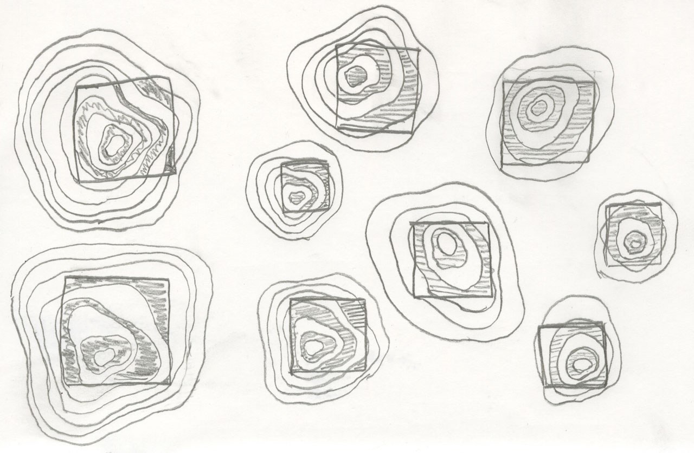
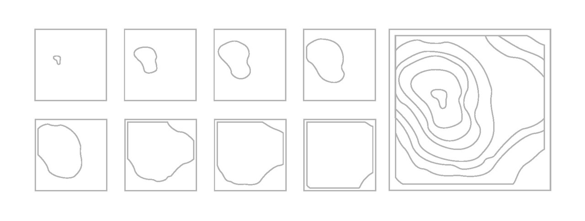
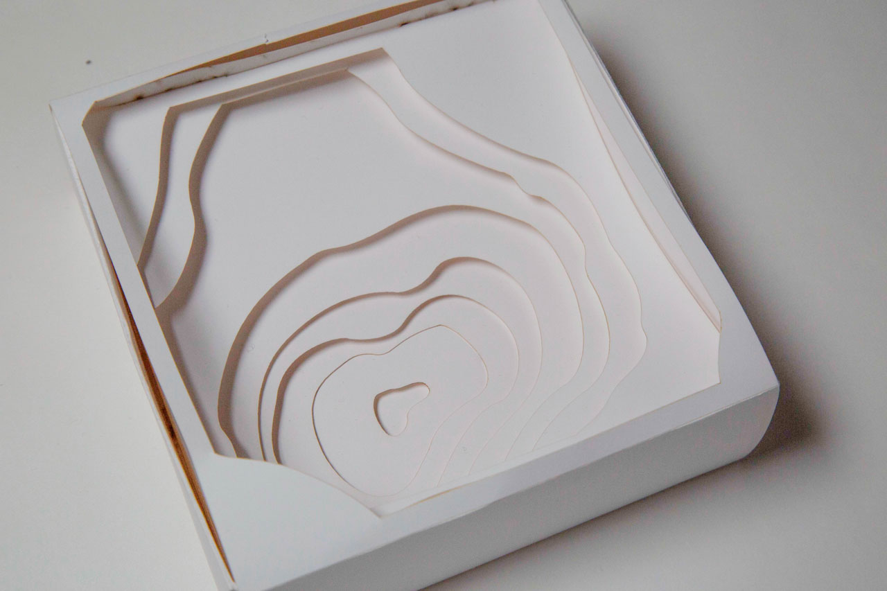
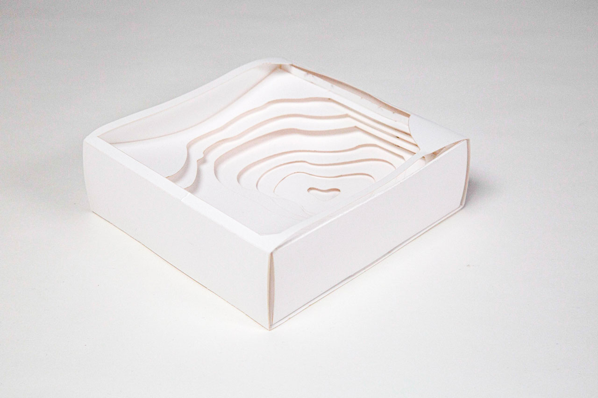

#### This eight-layered 3D shadowbox was inspired by the patterns found in tree rings and topographic maps. Lasercut. Assembled by hand without the use of tape or glue.

##### Sketches

##### Ouline of layers

##### Final model