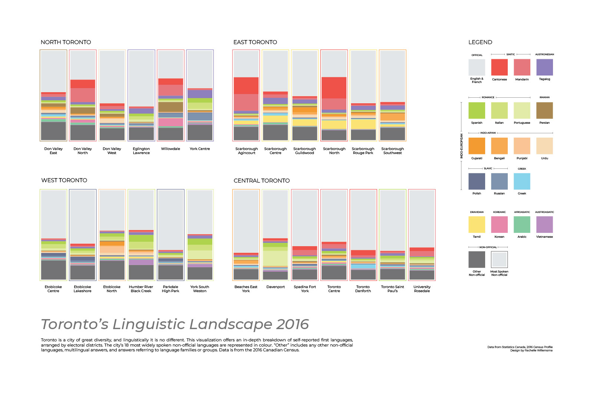
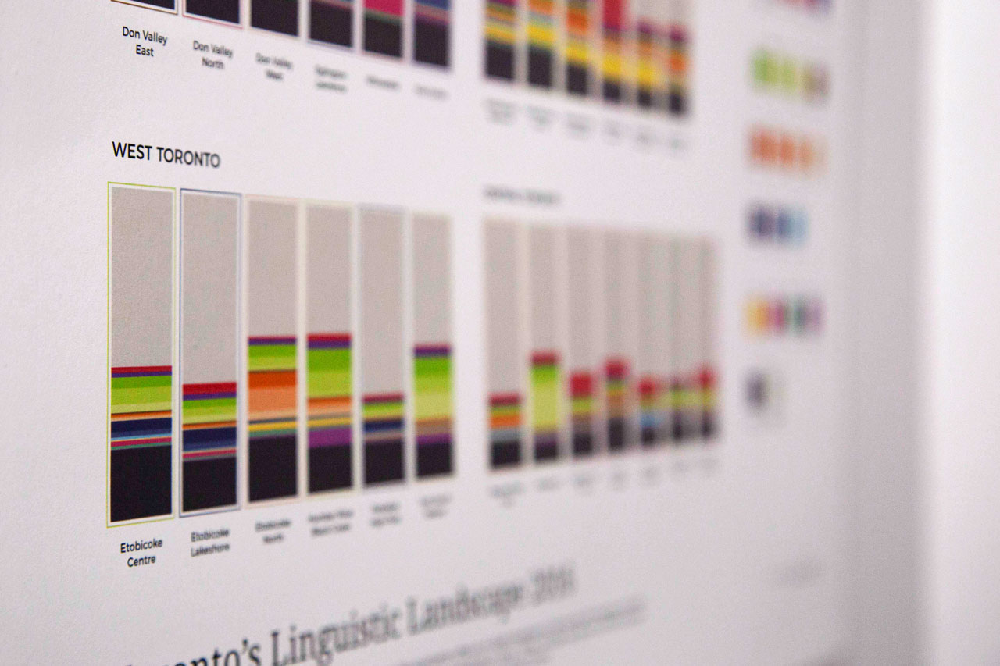
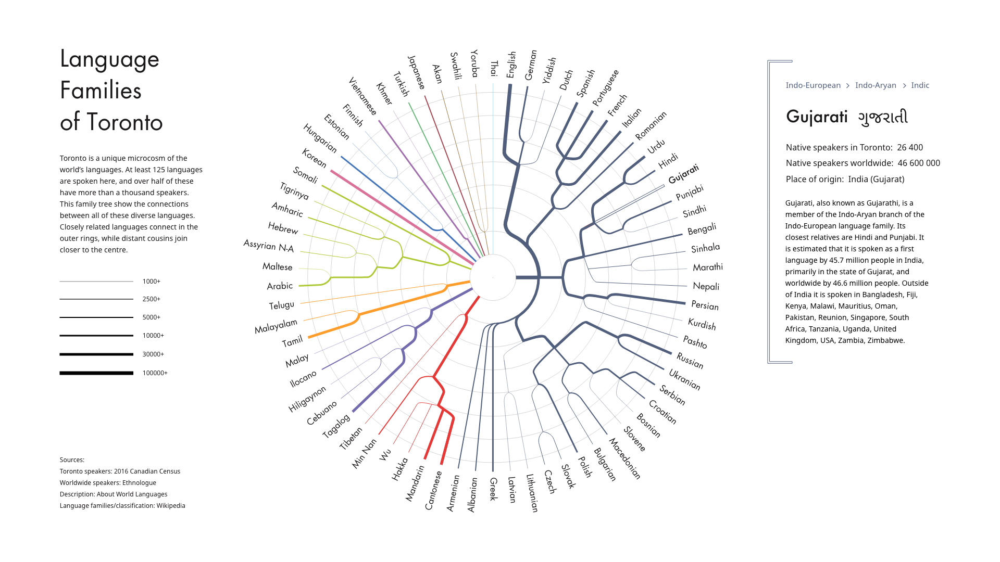
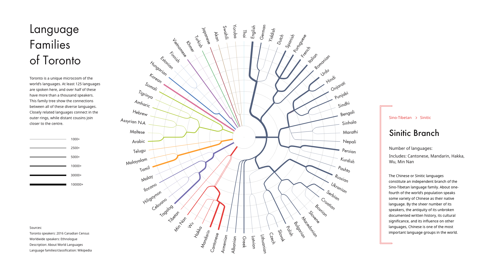

#### These companion visualizations show Toronto's linguistic diversity, with statistics from the Canadian census. The first piece was designed for print, and shows languages by electoral district. The second part is an interactive prototype, showing how these languages are connected by language families.

##### Print piece

##### Closeup

##### Interactive piece