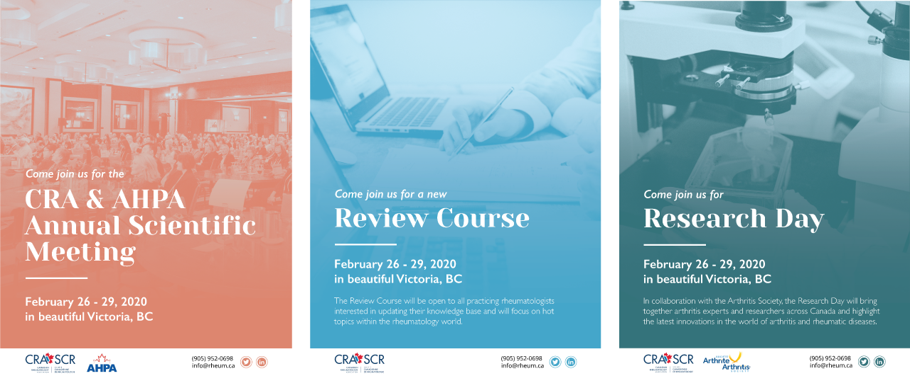
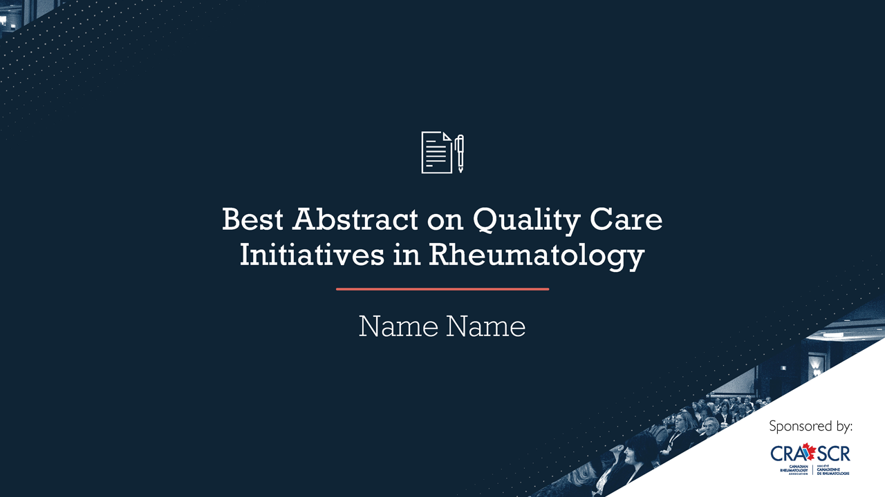
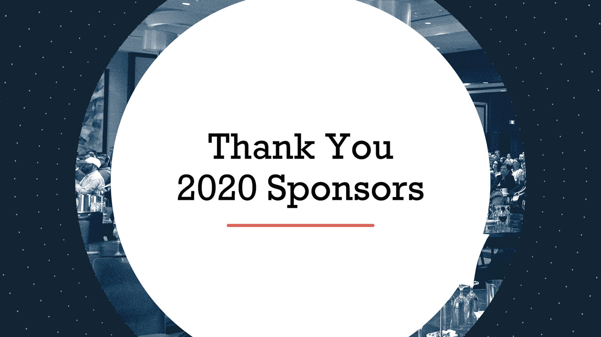
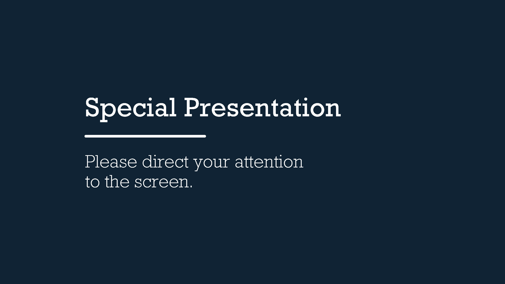

#### In the summer of 2019, I worked as a design intern for the Canadian Rheumatology Association. During the duration of this position, I designed various promotional materials, including posters, brochures, slideshows and other documents.

##### Poster series for the Annual Scientific meeting, the largest event put on by the CRA

##### A custom slideshow template for awards ceremonies