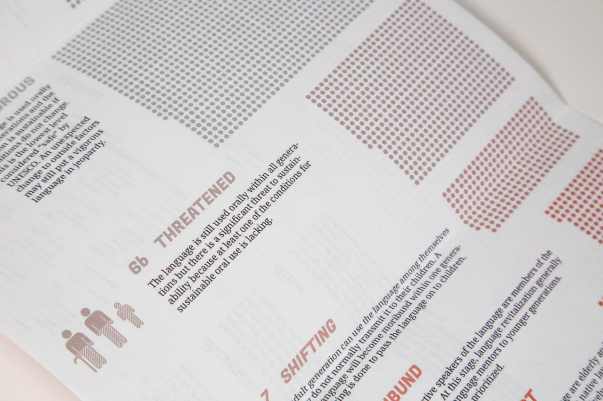
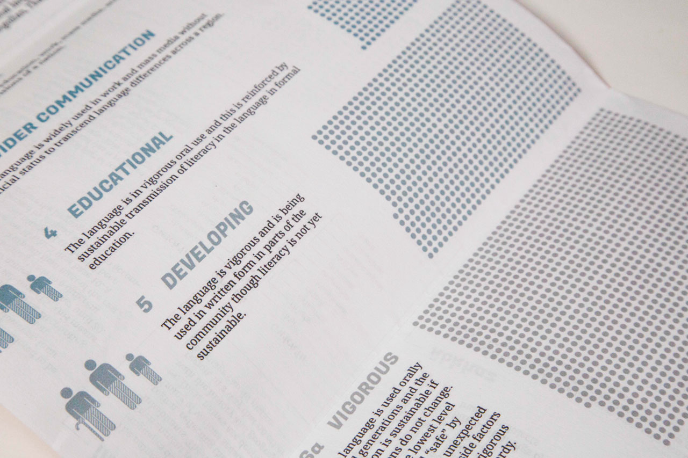
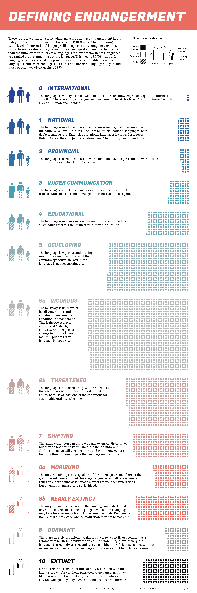

#### This large-scale unfoldable booklet outlines the issue of language extinction for a general audience. I chose this topic for the project because I felt it deserves more attention. The problem of language death is rarely discussed by the public, despite its major effects on communities around the world. This project was created for a university information design class.

##### Inside view

### Content

#### In order to underscore the importance of preserving the world’s languages, I put a large focus on individual endangered languages. Each language is unique in its own way, and some of the world’s rarest linguistic features are found in endangered languages. I included many examples of these on the innermost spread of the booklet.

##### Full inner spread

##### Full outer spread

### Design

#### I used bright red as my main accent colour as well as a bold display font in order to grab the viewer’s attention. The front page also uses a motif of a world map in the background to highlight that this is a serious global issue. Red is often used to signal danger, and in this context it represents the danger of extinction. Languages which are most at risk use colours closer to red, while those at least risk use blue, a much calmer colour.

##### Half open spread