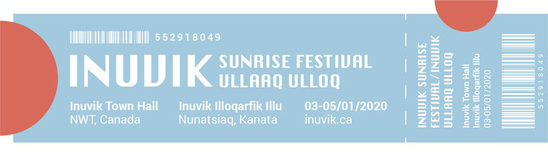
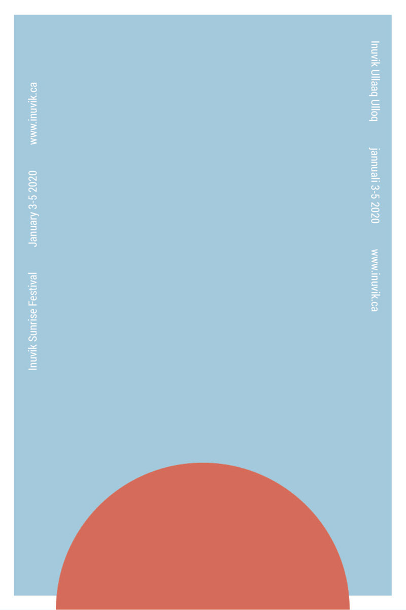
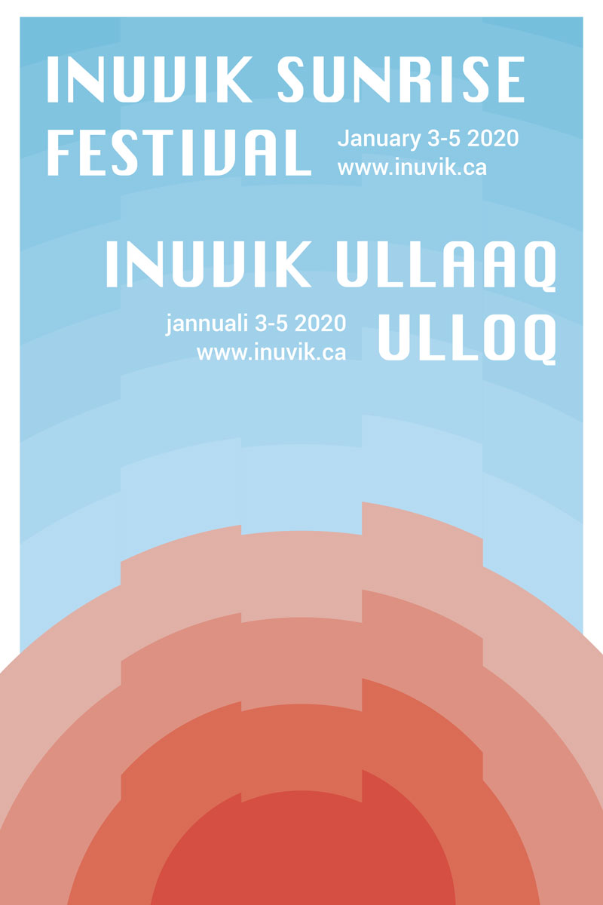
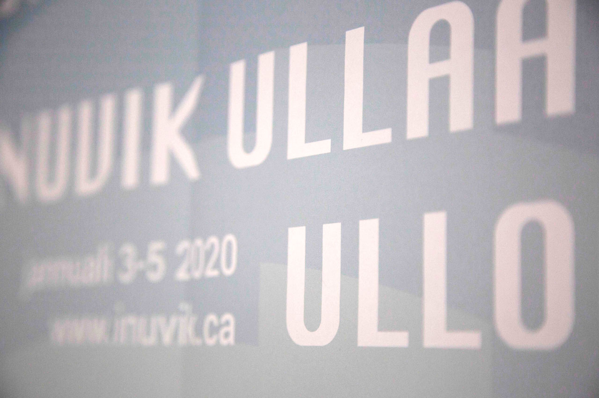

#### Inuvik is a small town in the Northwest Territories which experiences polar night for a month every year. The sunrise festival celebrates the return of the sun in January. This project is a speculative branding campaign for the festival, including tickets, posters, and more.

##### Festival tickets

##### Minimalist poster design

##### Alternate poster design

##### Closeup