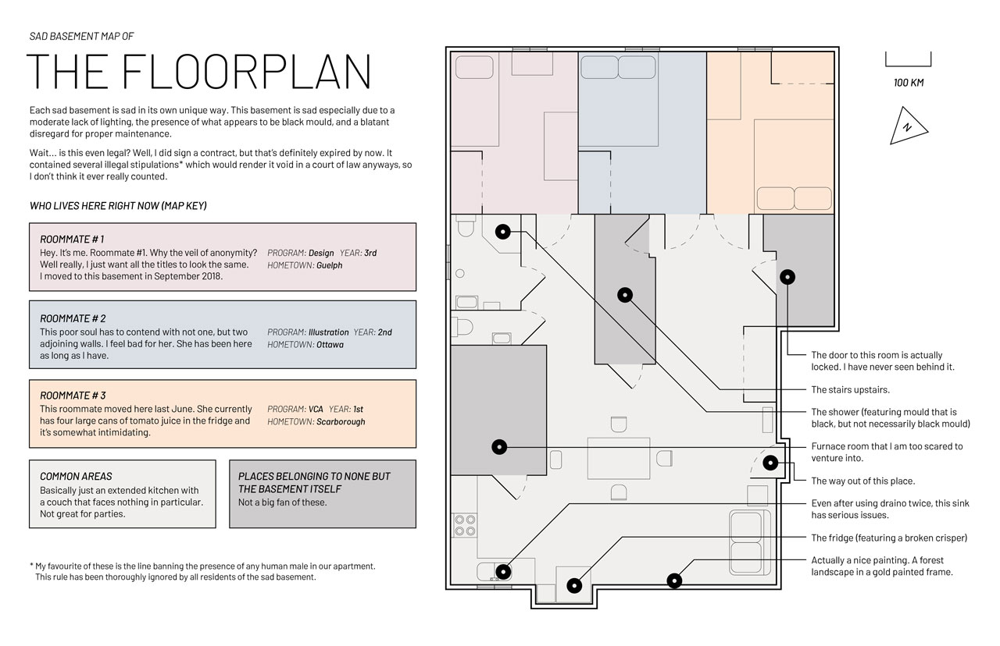
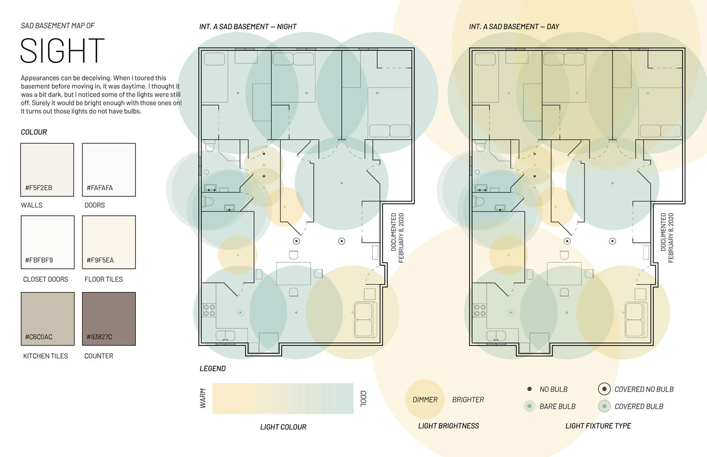
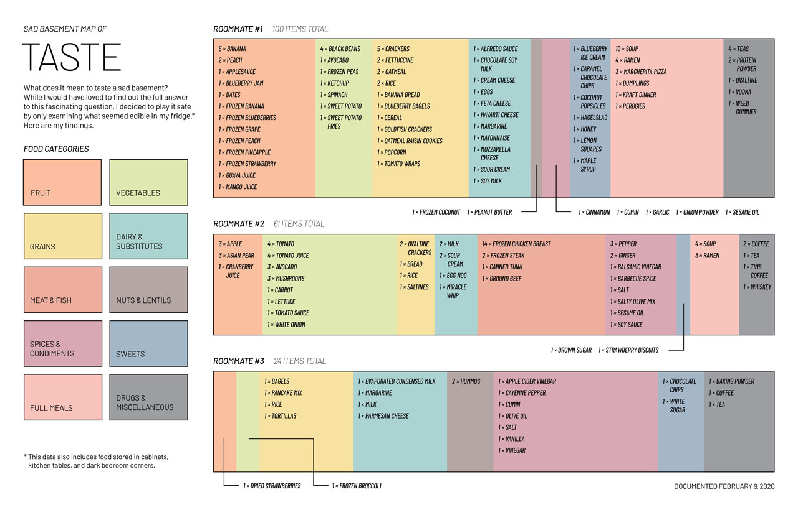
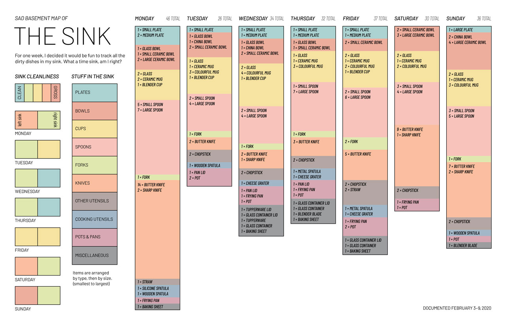

#### This premise of this project was to document a space with the use of the five senses. I chose to document the basement apartment I was living in at the time. This project was created for an information design course.

##### Basement floorplan

### Background

#### During my stay in this apartment I found the conditions to be generally dark, dank, and dirty. I decided to vent some of my frustrations through this project. I began by collecting information about the basement. I walked around searching for sights, sounds, and smells. I asked my roommates which food they each had in the fridge, and threw out an alarming amount of suspicious containers that no one claimed as theirs. Each day for a week, I diligently combed through the kitchen sink to check the number of dirty dishes accumulating inside. All the while, I documented all the information I learned.

##### Light map

### Design

#### Each of the seven pages of this project was designed at tabloid size. For each page, I stuck to the same main format with a few modifications depending on the page’s content. Three different styles exist, one with a single floorplan, one with two, and one with bar charts. The floorplan itself was created based on the actual measurements of the apartment’s rooms and furniture. I referenced professional floorplans in order to make mine in the same style.

##### Food inventory visualization

### Conclusion

#### While I do not regret moving away from my sad basement apartment, I’m glad I completed this project before I did. I’m now happily living in a new place, and this project serves as a great reminder to appreciate the improved living conditions I have now.

##### Bonus page: documentation of sink cleanliness