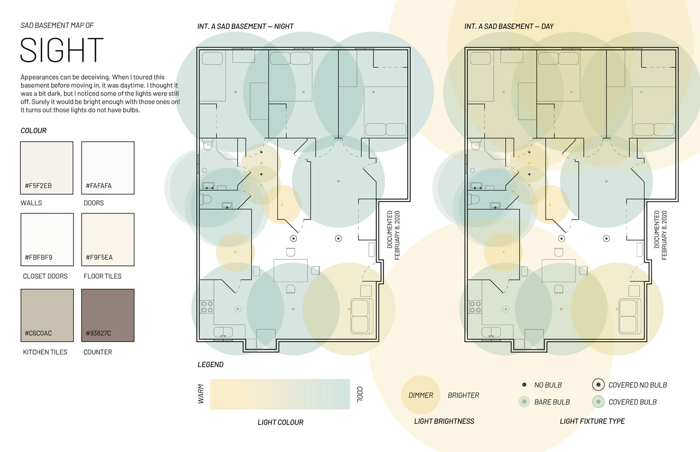
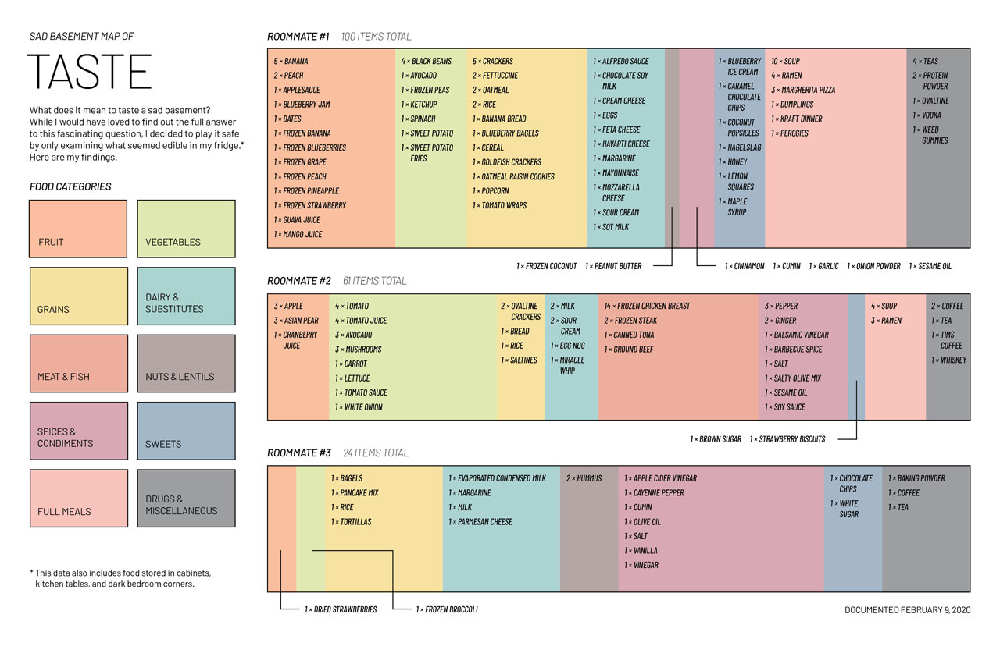
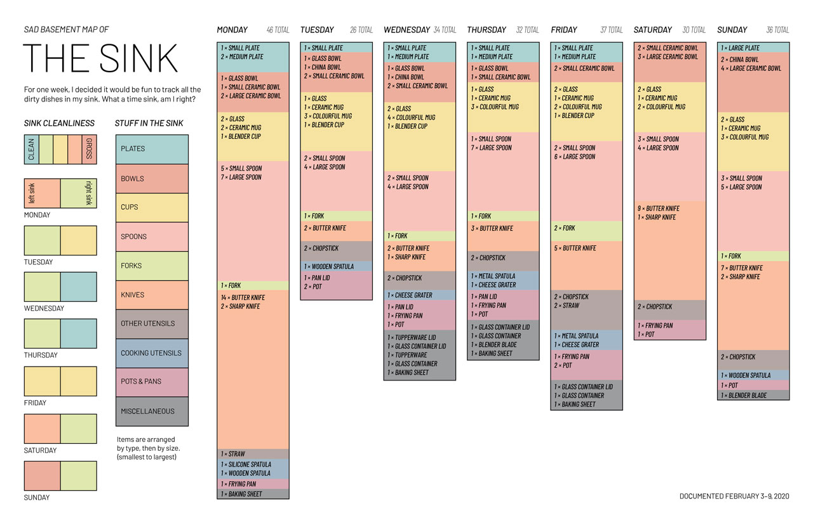

#### For one of my information design assignments, I decided to examine and visualize my own basement apartment through the five senses. Each page measures 17″×11″, with seven pages total.

##### Basement floorplan

##### Light map

##### Food inventory visualization

##### Bonus page: documentation of sink cleanliness