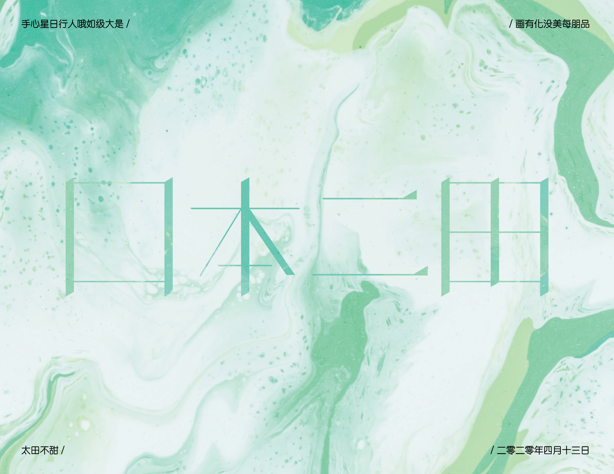
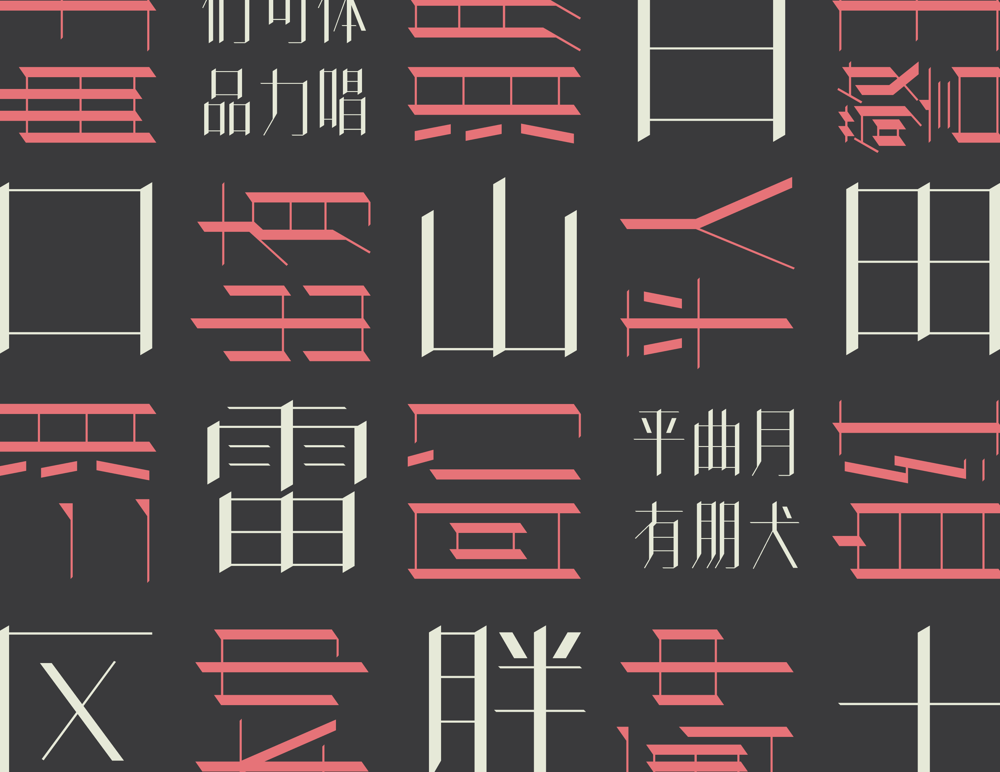
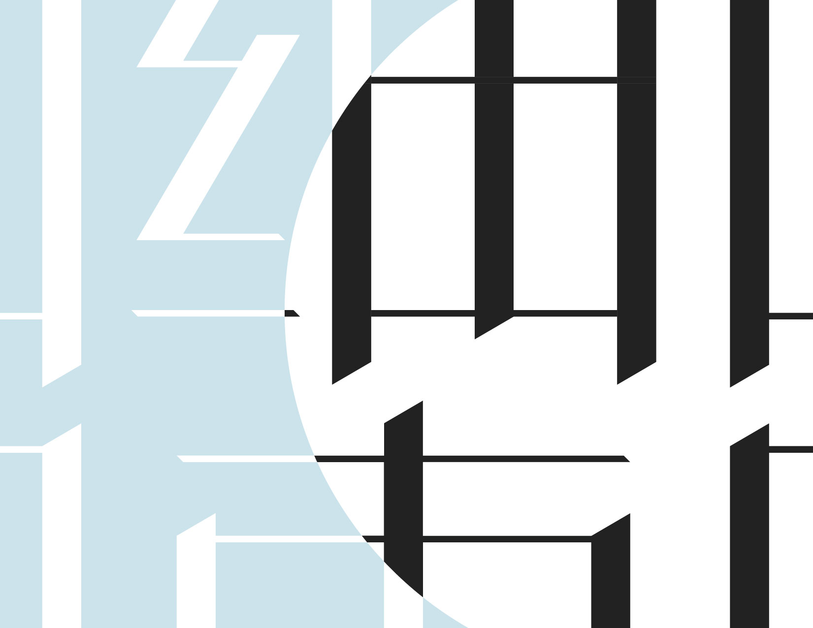

#### Xihei attempts to bring a modern blackletter look to Chinese characters. Its width is variable, which accommodates longer or shorter titles without having to change point sizes. Xihei comes with just over 60 chinese characters so you can write very specific short messages. Featured words include&#58; product, thunder, green, three, and towel.

##### Usecase examples