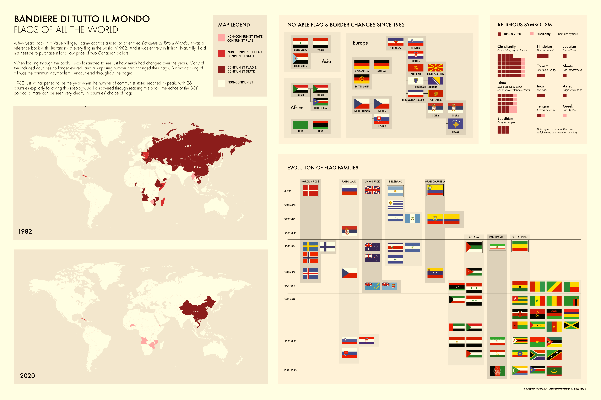

#### This project visualizes the contents of a book and the experience of reading it. It was created for an upper year information design class. While the brief was designed with fiction books in mind, I adapted it to work for a non-fiction book.

### About the Book

#### The book I chose for this project is Guida alle bandiere di tutto il mondo (Guide to flags of the whole world). It is an Italian reference book published in 1982 which contains the flags and coats of arms of every country, as well as those of states or provinces in some select countries. Flags are one of the most important national symbols, and one of the few that can be changed overnight. This makes them an interesting lens through which to view a country’s politics and culture.

### Research

#### I gathered data on the book’s flags through an Airtable spreadsheet. For each country, I determined the flag’s religious and political symbolism in 1982 and 2020, and whether it had changed. I also did research into flag families in order to group flags with similar symbolism and a shared history. Additional research into border changes and historical politics was also necessary for some aspects of the visualization.

### Poster 1

#### On my first poster, I chose to explore different lenses through which to view and categorize the book's flags. These were: flag changes, flag families, communist symbolism, and religious symbolism. A common theme throughout these visualizations is the comparison of the past and the present, which is an inevitable part of reading an old book such as this.

##### Flag families, symbolism, and changes since 1982

### Poster 2

#### The second poster is focused on communism and communist flags, since this was the thing that stood out to me most when reading the book. The symbolism of these flags is explained, and examples are used to illustrate changes since 1982. I decided to use a timeline of communist states to further contextualize this moment in time, where communism and the USSR had a large impact on global politics.

##### Exploring political and flag history in more depth

### Visuals

#### As a baseline, I used a greyscale theme in my project in order to prevent colour clashing with multicoloured flags. Other than this, I used three shades of red for some of the content. This was used mainly used to represent communism, which is commonly represented by this colour. These colours were also used in the religious symbolism panel for visual consistency, even though this is unrelated to communism. One of the largest challenges of this project was fitting so much content onto only two pages. My solution to this was to segment each page into smaller themed areas.

 