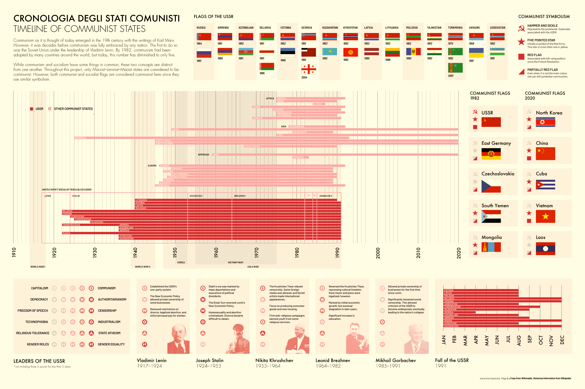

#### Out of all the old books I own, my favourite is titled Bandiere di tutti il mondo. As someone with an established interest in vexillology, it's facinating to look through this flag book from 1982 and compare it to the flags of today. One of the most stiking differences is the marked decrease in the number of flags with communist symbolism from the 80s until today. In this project, I explore the history behind these changes.

##### Flag families and changes since 1982

##### Exploring communist flag symbolism in more depth