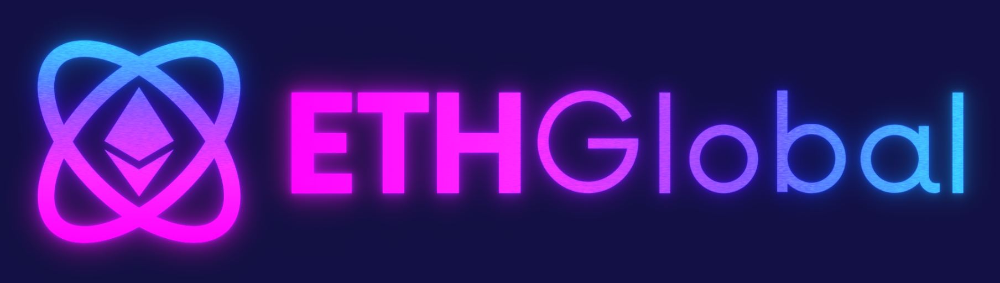
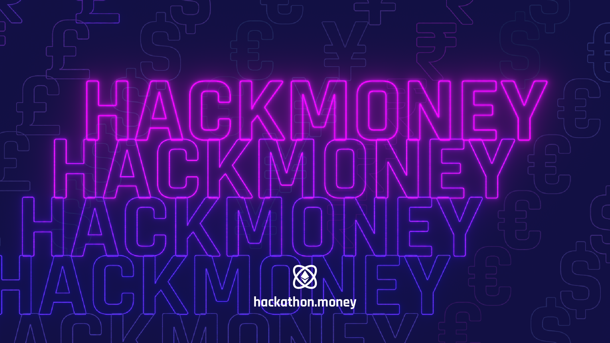
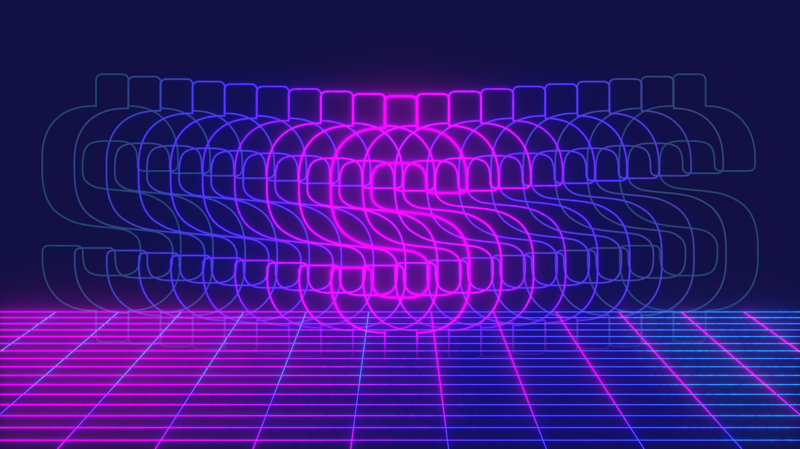
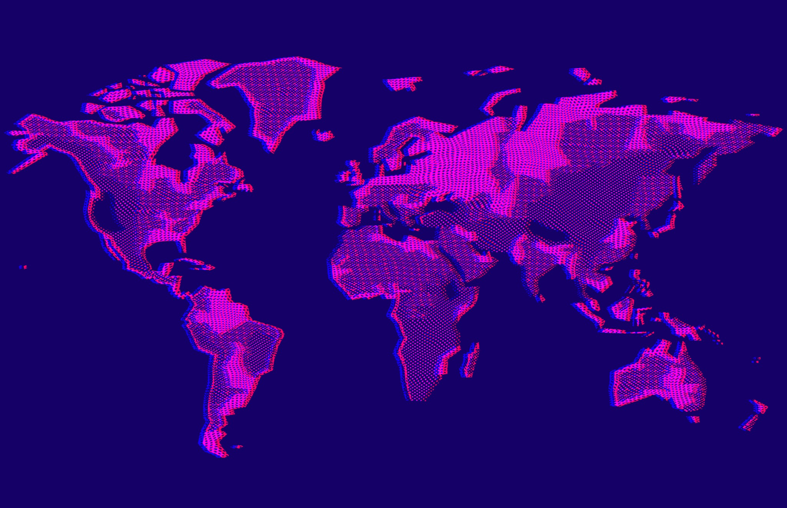
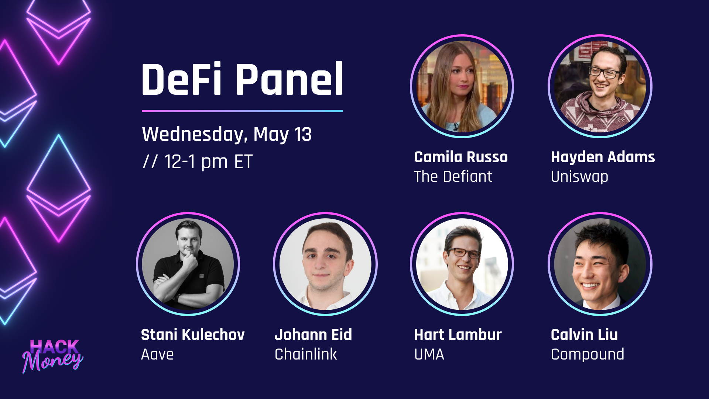
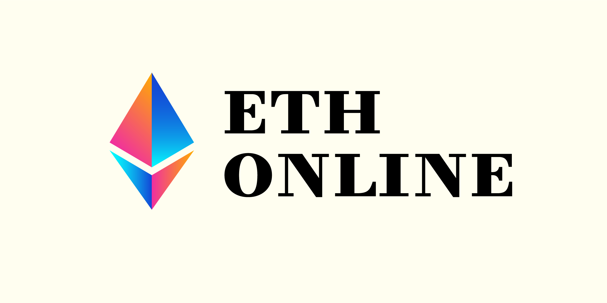
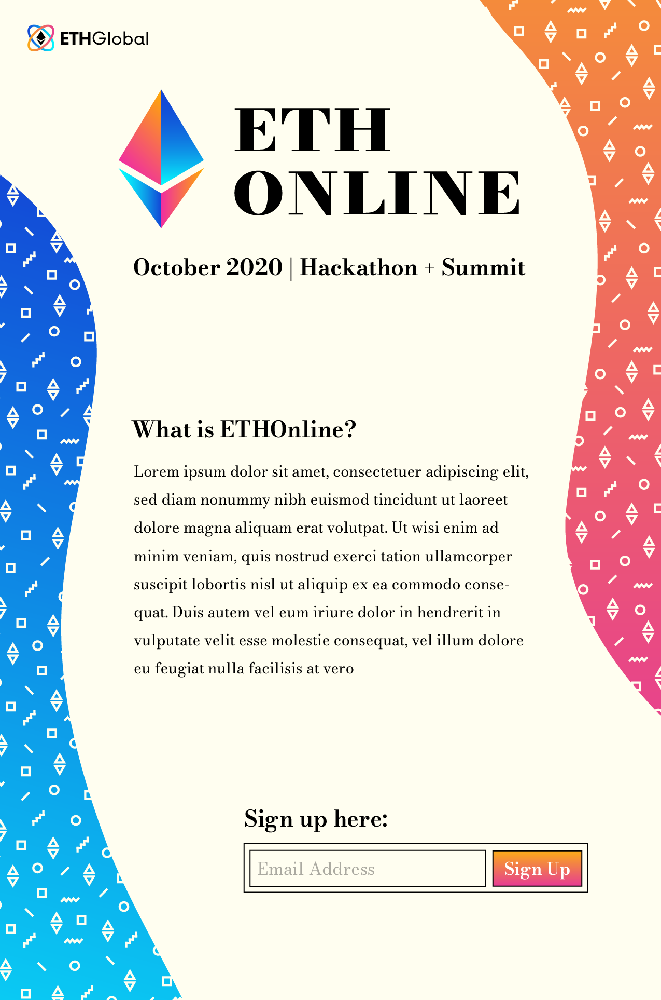
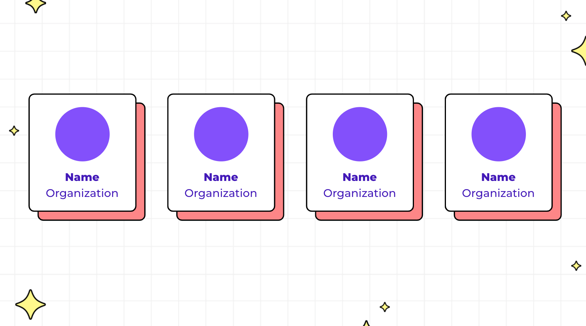
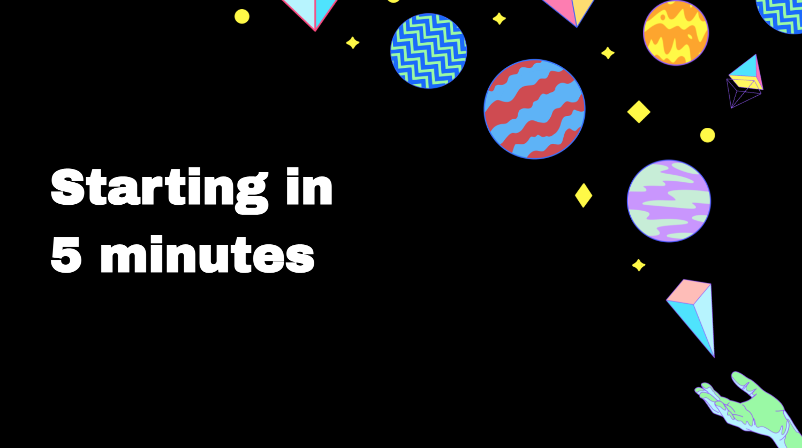

#### For over two years, I have worked part-time as a designer for <a href="https://ethglobal.co/" target="_blank">ETHGlobal</a>, an organization which hosts some of the world’s largest Ethereum-focused hackathons. Projects generally include creating and expanding branding for hackathon events, and on occasion I have also offered design services to event participants.

### HackMoney 2020

#### This was the first hackathon event I created design work for. A few initial branding assets had already been created for this event. However, they lacked consistency, especially with colour use, and editable file formats were not provided. While I did make use of the existing logo and general colour palette, for the most part I created the remaining branding content from scratch, including zoom backgrounds, promotional posters and social media cards. I used <a href="https://natrongithub.github.io/" target="_blank">Natron</a>, an open-source node-based program, to achieve the glow effect used throughout the branding.

##### Promotional poster

##### Hackmoney zoom background

##### Another zoom background

##### One of many social media templates

### ETHOnline 2020

#### In contrast to my work on HackMoney, I created the initial branding for ETHGlobal’s ETHOnline event, which was then expanded by other designers and artists. The aesthetic of this event was inspired by old 90s Apple advertisements. The use of a serif typeface and off-white background were both informed by this theme. In total, I created the initial event logo, modified ETHGlobal logo, and colour scheme. I also came back to the project to work on the final stage of design work, which included speaker cards and slide decks.

##### ETHOnline Logo

##### Initial branding demo

### Other Events

#### I have worked to expand branding for several other events. Most commonly, I have worked on social media cards and slide deck templates.

##### NFT Hack speaker card template

##### Scaling Ethereum presentation slide template

##### HackMoney 2021 youtube banner