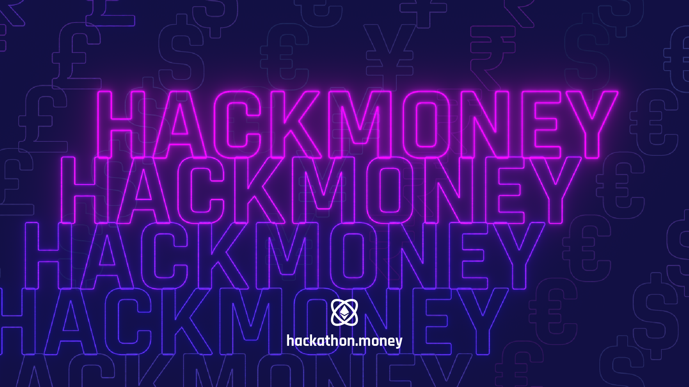
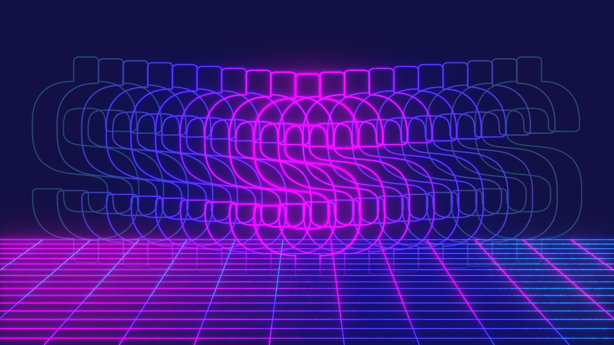
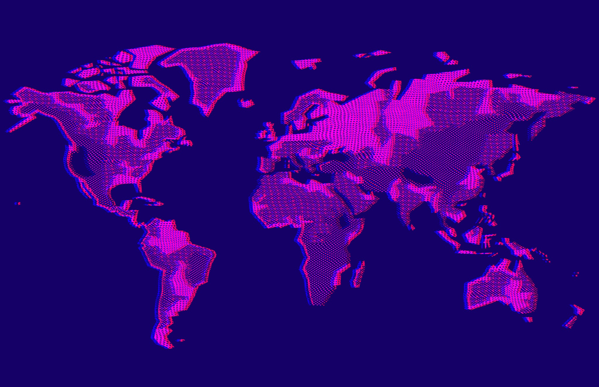
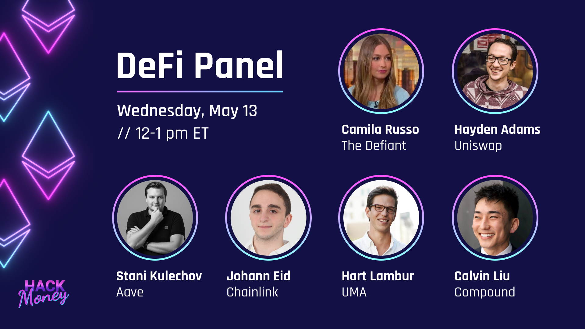

#### In the summer of 2020, I had the chance to work as an intern at ETHGlobal. I helped to expand the existing branding for HackMoney, an online hackathon run by the organization. I used Natron, an open-source node-based program, to achieve the glow effect used throughout the branding.

##### Promotional poster

##### Hackmoney zoom background

##### Another zoom background

##### One of many social media templates