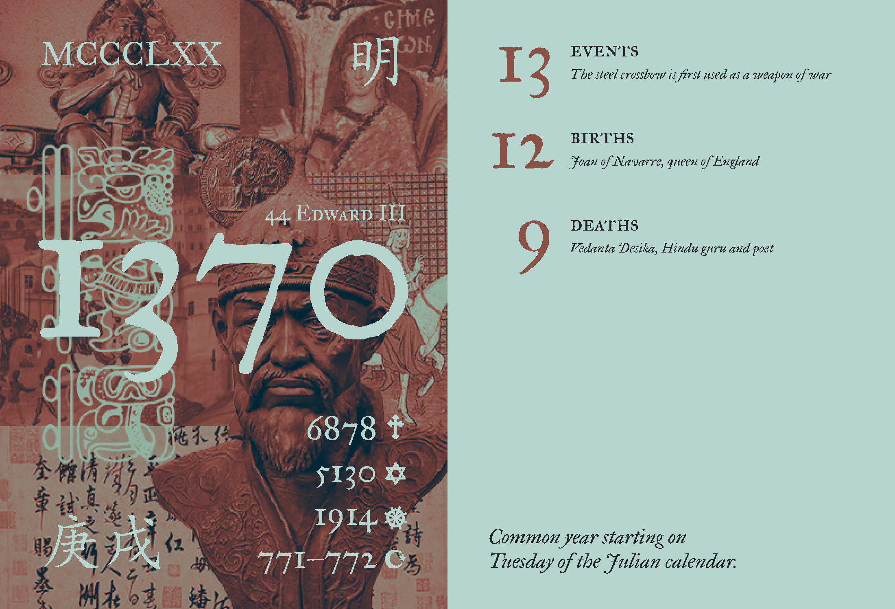
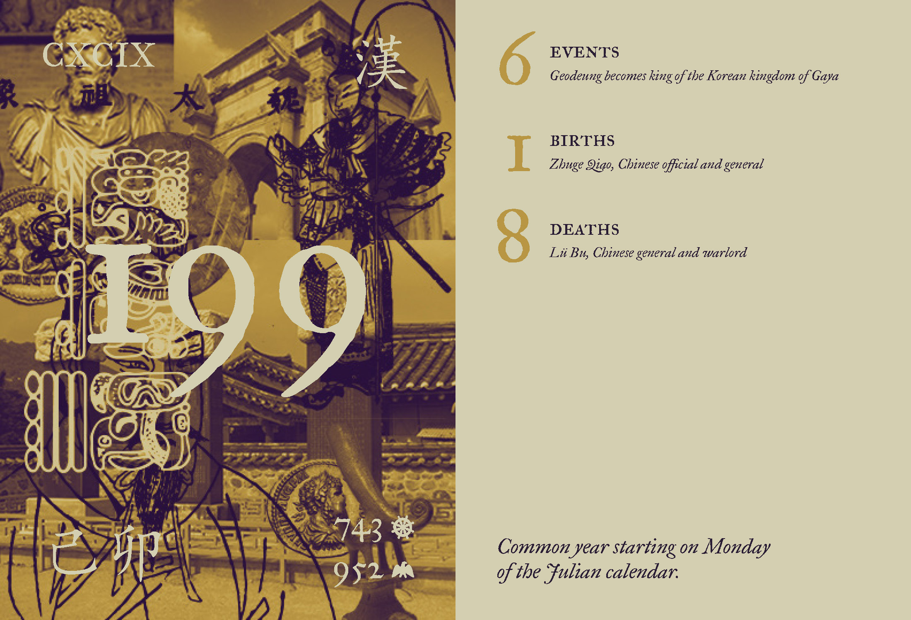
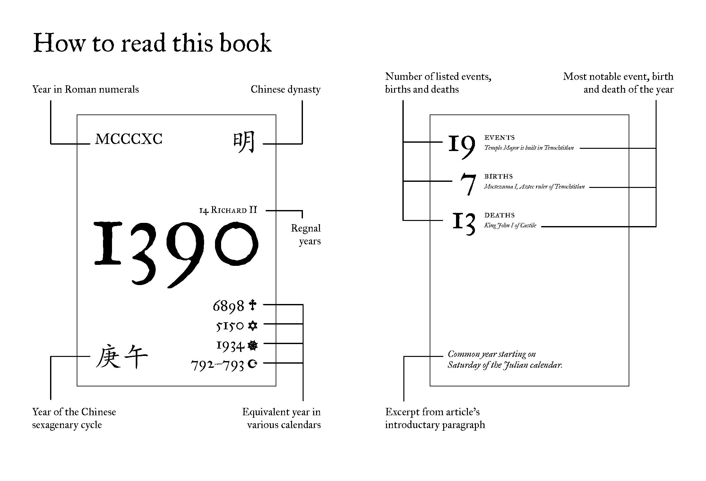
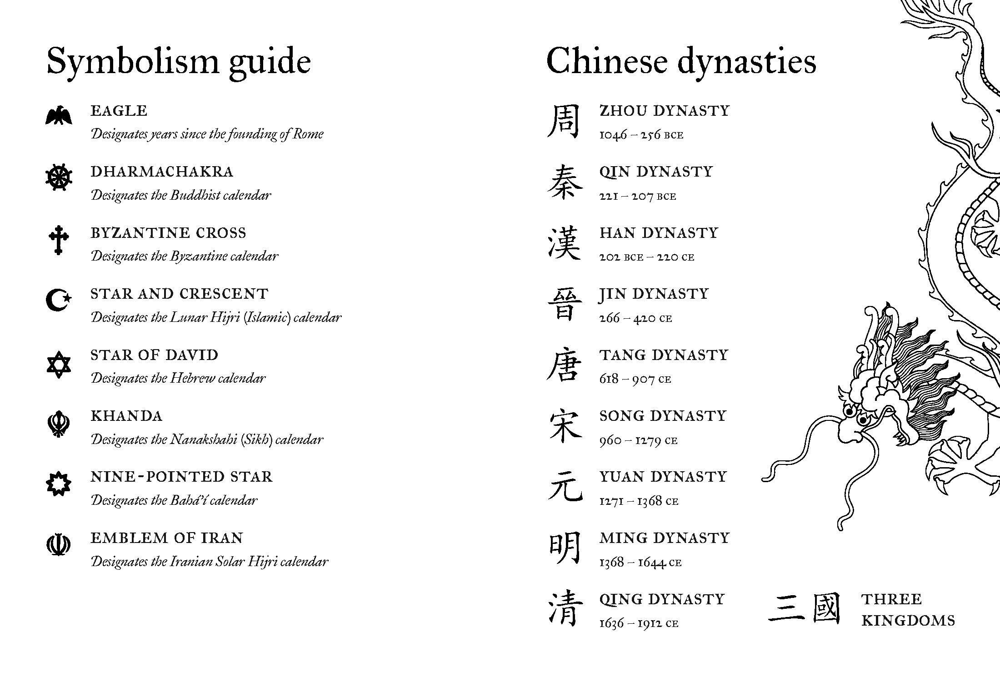
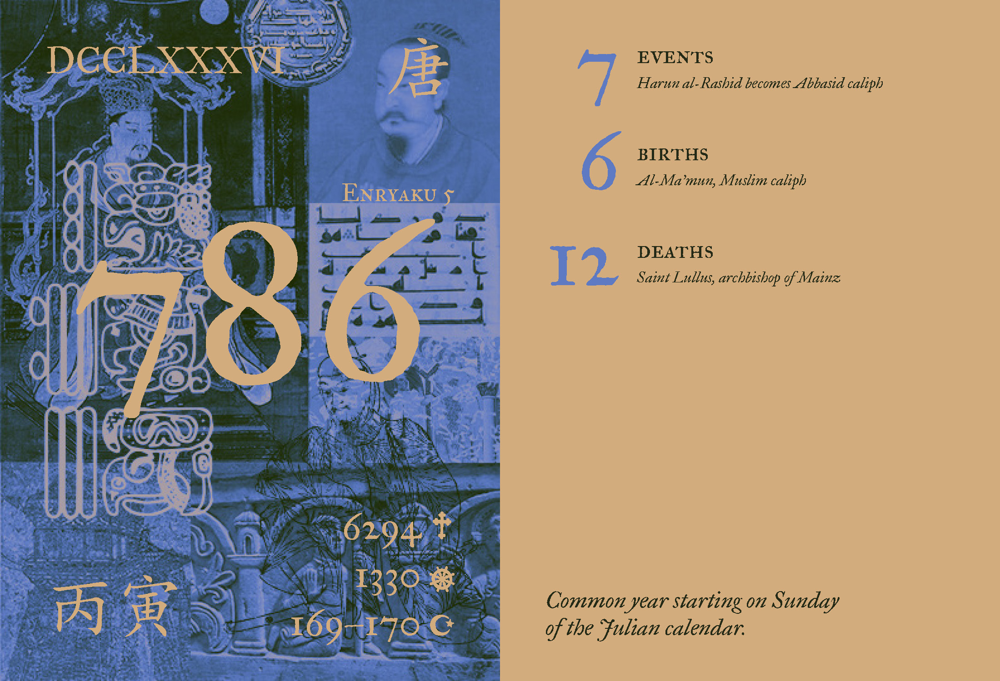
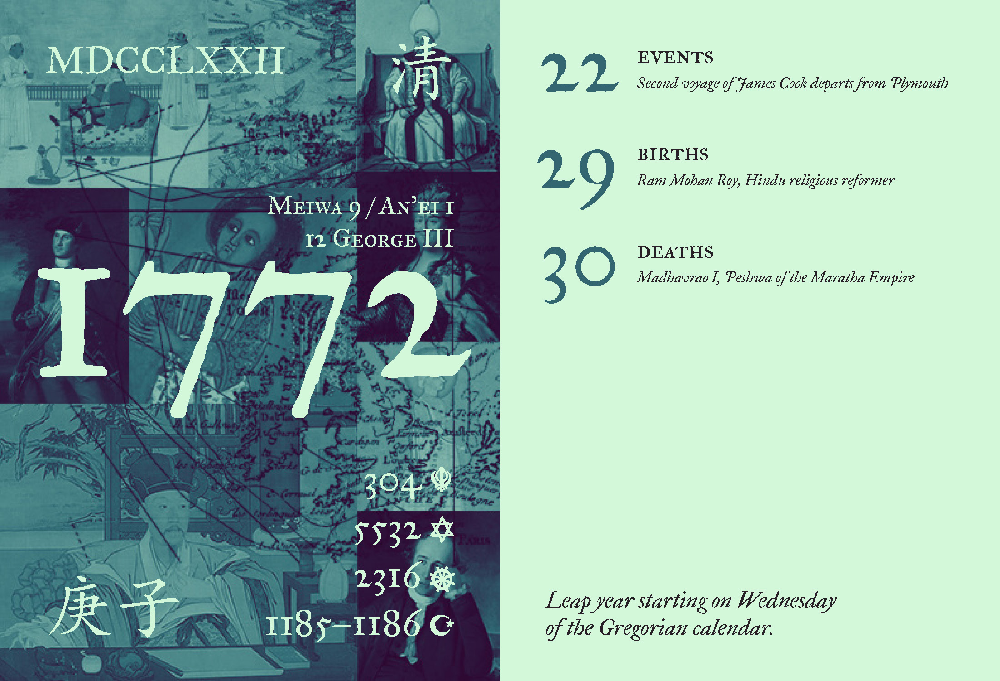
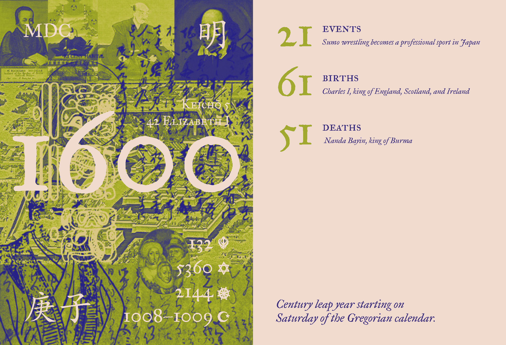
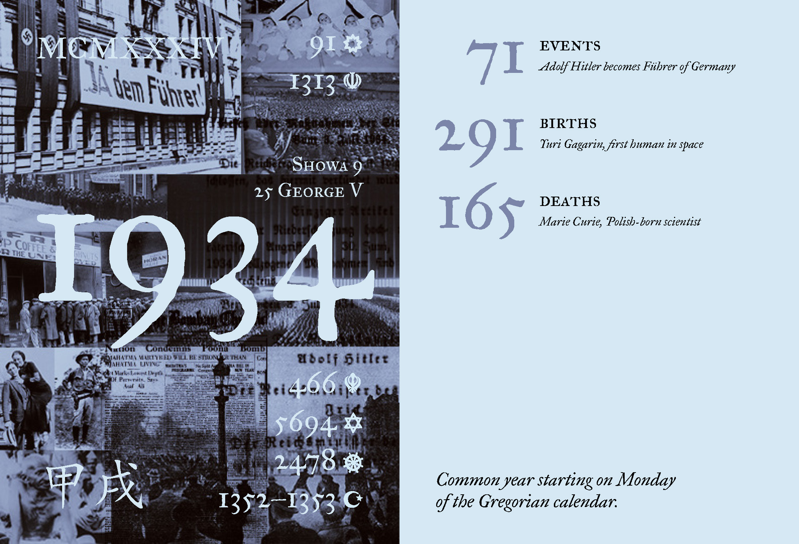
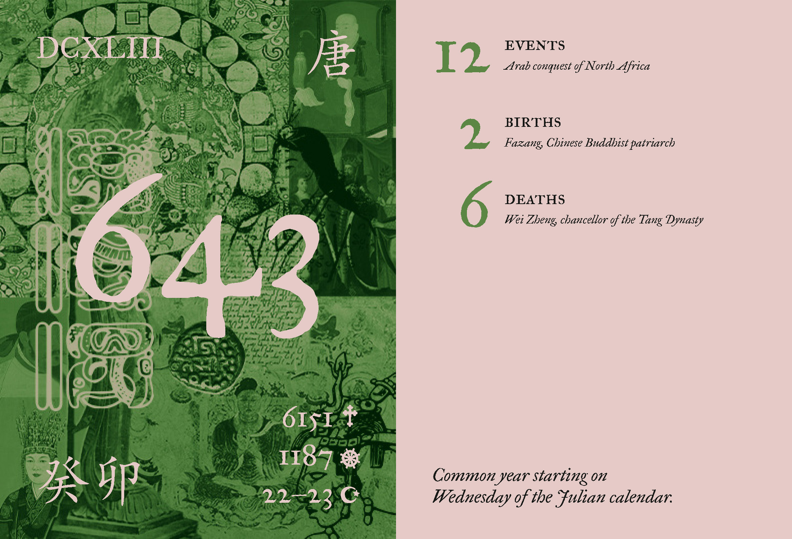
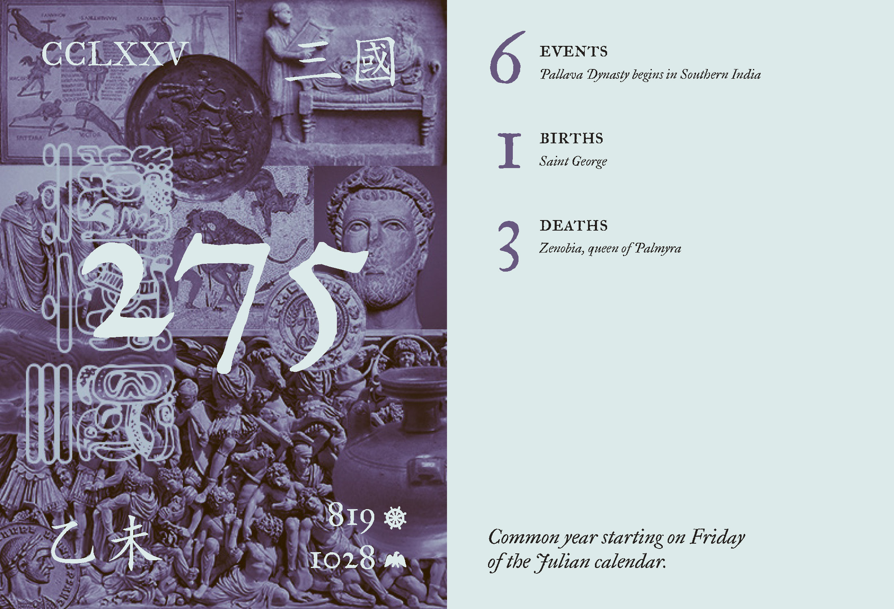

#### This project is a 40–page digital book which explores various years in recorded history through their respective <a href="https://en.wikipedia.org/wiki/List_of_years" target="_blank">Wikipedia entries</a>. It was created for an upper year book design course. 

### Background

#### While deemed an unreliable source in academic situations, Wikipedia remains the internet’s go-to source for quick information. Its prevalence and scale make it a great resource for exploring the basics of new topics and discovering unexpected connections between different concepts. Of relevance to this project specifically are the articles Wikipedia maintains regarding each year from 700 BC until 2029 AD. These generally follow the same format, listing notable events, births and deaths which took place during the given year. The site’s heavy use of hyperlinks make these pages excellent entry points for learning about historical periods.

### Content

#### I began my process by selecting 16 years at random from the list of year articles on Wikipedia. For each of these 16, I counted and selected the most interesting entry of the year’s events, births, and deaths. I was also inspired to look into the various calendars in the sidebar, which give each year many different names. While Wikipedia contains unchanging lists of these, I wanted to only show a calendar in my project if it was in use during the highlighted year. For example, having the Byzantine calendar only appear in years where the Byzantine Empire was in existence. 

### Visuals

#### All images were sourced from Wikipedia. Due to Wikipedia’s policies and the historical nature of most of the images, finding images in the public domain was usually not too difficult. For each year, I aimed to source artwork and artifacts from all over the world in order to give a good overview of the year as a whole. However, this was difficult at times due to the scarcity of images, especially for more ancient times. For some years I had to broaden the scope for acceptable images to a window of a decade or more. These images I then made into collages for each year.

### Colour

#### I created an individual tritone colour scheme for each year, to be applied to the collage, text and page background. The choice of colours was based on aesthetics combined with symbolic representation of contemporary civilizations. For example, shades of deep purple were incorporated into the palette for years between 211 BC and 338 AD as a representation of the Roman Empire, while green appears in 643 AD to show the emergence of Islam. Outside of pages dedicated to individual years, a monochromatic or full colour palette was used.

