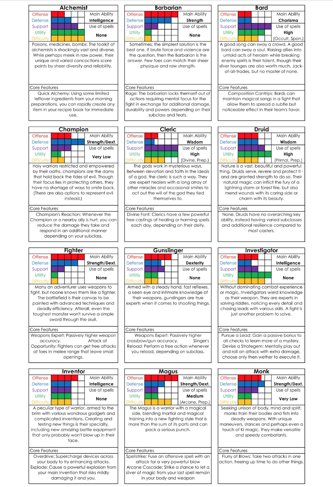
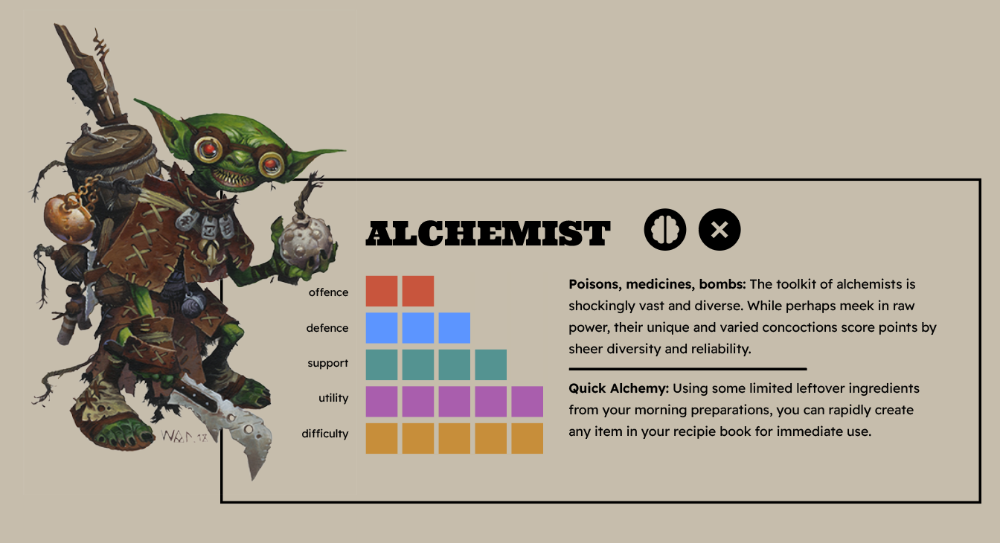
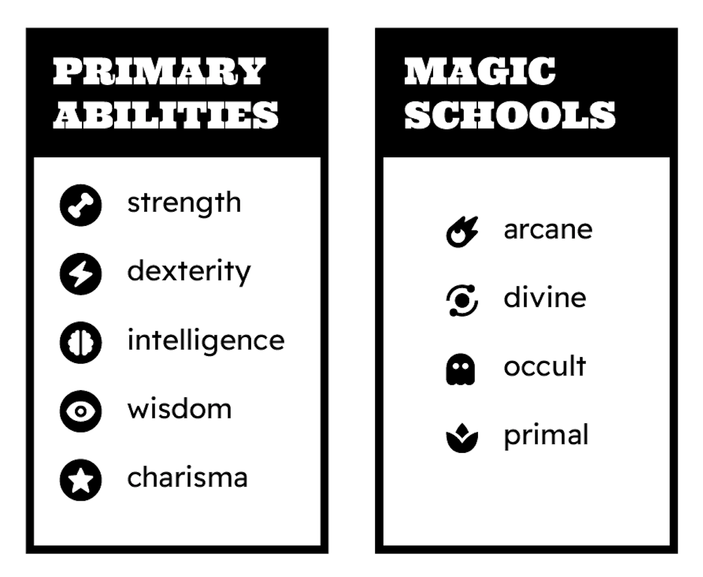
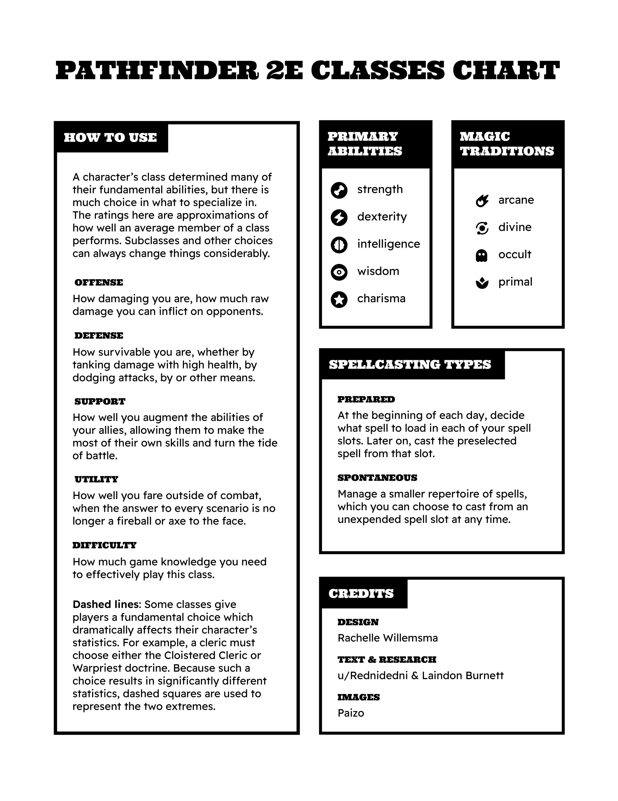
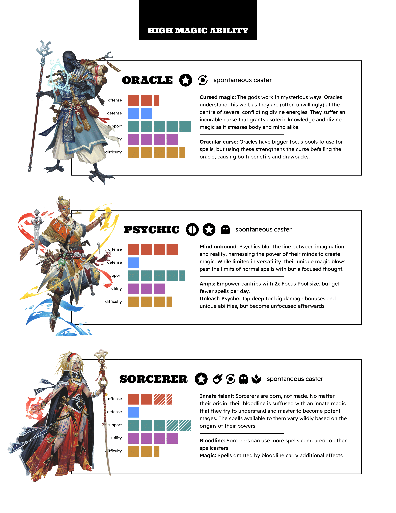

#### This infographic is an overview of character classes in the tabletop roleplaying game Pathfinder 2E. While I myself have not played this game, I found that visualizing the differences between different character types made for a fun information design challenge.

### Background

#### The idea for this project emerged when my friend showed me <a href="https://www.reddit.com/r/Pathfinder2e/comments/ts8m4v/i_tried_summarizing_all_classes_to_help_newer/" target="_blank">this overview</a> of Pathfinder 2E classes, created by reddit user Rednidedi. Although I have not played Pathfinder myself, I found myself intrigued by the information displayed in this chart. However, I felt that the presentation could be improved. I had a sudden urge to put my own spin on the project, completing the first draft of my own version within a single day.

### Changes

#### While on first glance, the information in the original chart appeared to be well organized, a closer look showed some missed opportunities. For example, the classes are ordered in alphabetical order, which is not a bad choice in isolation. However, I believed a more intuitive choice would be group them based on similarity. In this case, I grouped the classes by their use of magic, since this difference heavily affects playstyle. Another benefit to grouping the classes was breaking up the repetitive design of the original. Dividing the list into smaller sections makes the information feel less overwhelming to take in.

### Icons

#### Another aspect I thought could use improvement was the use of plain text to convey information such as primary abilities. Since there are only five of these abilities, I chose to create icons for them. This way, the reader would be able to interpret this information at a glance instead of having to take the time to parse text at every instance abilities appear on the page. I also created icons for magic schools, since this is a key difference between the classes which was not consistently specified in the original graphic. In order to differentiate the two types of icons, the primary ability icons were reversed onto a black circle. I chose not to create icons to distinguish between prepared and spontaneous casters because I believed that it would create too many different types of icons to be easily interpreted by the reader. Furthermore, only a minority of classes have either trait, so reading it as text for each class would not be too repetitive.

### Reception & Updated Version

#### To my surprise, my infographic gained huge popularity on the Pathfinder <a href="https://www.reddit.com/r/Pathfinder2e/comments/12147av/pathfinder_class_summaries_for_new_players_pretty/" target="_blank">subreddit</a>. It is now the most popular visualization of the game's classes, and the top result on Google Images. A year after my original visualization, there was an update to the game. The update included adding a new player class, the thaumaturge, so I decided to update my infographic to reflect this. Adding a new class was easier said than done, since my original layout had not accounted for changes. I also took this opportunity to make corrections that were pointed out to me by viewers on the subreddit. I also elected to create a version with a white background for legibility and printability reasons. Unfortunately, the game has had yet another update since then, so I will have to rethink my layout once again! Hopefully, I will be able to future-proof the design this time.

### Booklet Version

#### I realized early on that Pathfinder 2E players might find it useful to print a version of this poster for their own reference. However, as it was, printing the poster on standard letter paper would render the text much too small to read with ease. The off-white background would also pose an issue as most printers do not print colour fully to the margins of the page, and some readers might be hesitant to waste their printer’s ink. I chose to create a booklet version without the background in order to solve these issues.

 