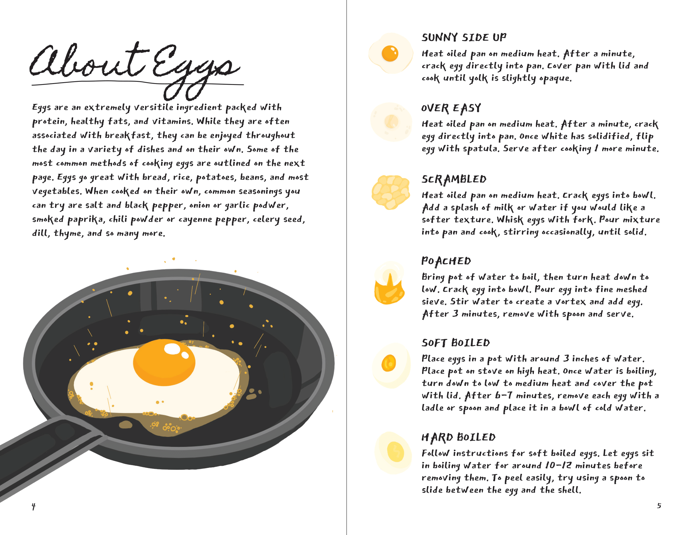

#### Zines are smaller-scale magazines, usually self-published and containing personal or niche content. While I've held an interest in zines for some time, this was my first attempt at at publishing one myself.

### Concept

#### I was inspired by <a href="https://www.theinc.ca/wp-content/uploads/2022/01/Menezes_Depression_Cooking_Zine.pdf" target="_blank">depression cooking</a> by Sonali Menezes, since it resonated a lot with my own cooking experience. With the help of my good friend, who created the illustrations, I set out to make my own cookbook zine, which I hope would likewise help those who have had similar difficulties.

### Recipes

#### Due to the brevity of the medium of a zine, I chose to select a common theme through which to unite my recipes and advice. I chose to focus on egg recipes, and I also made an effort to condense the amount of other ingredients. This way, readers will be able to shop for ingredients before committing to any single recipe. I also made ingredient lists as flexible as possible to adapt to what readers already have in their fridge.

### Design

#### I acted as author, art director and designer for this project. The illustrations and icons were created by Manola. The final appearance of the zine was largely influenced by these illustrations. I used paler versions of the colours in these pieces to create more dynamic backgrounds which made the illustrations pop.

### Typography

#### I wanted the style of the text to be casual and approachable, with a handmade feel. Zines are often made by hand and sold within artistic circles, so I wanted to match this aesthetic. For titles I used a cursive font called Homemade Apple. This font, like most cursive fonts, often needed to be manually kerned. For the body text I chose East Sea Dokdo, an angular marker-style font.

### Layout

#### For recipes I stuck to spreads with a full page image facing the recipe content in order to let the illustrations shine. While I stuck to this overall layout, I was a bit more loose with more minor aspects of the layout, for example with each recipe title. This allowed the zine to have a more casual flow while maintaining visual interest.

 